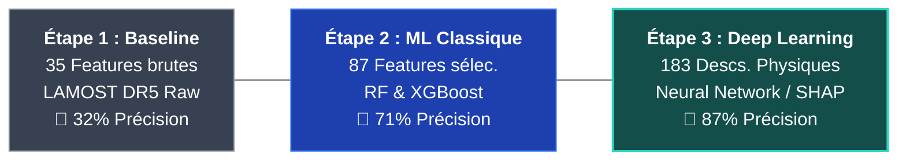
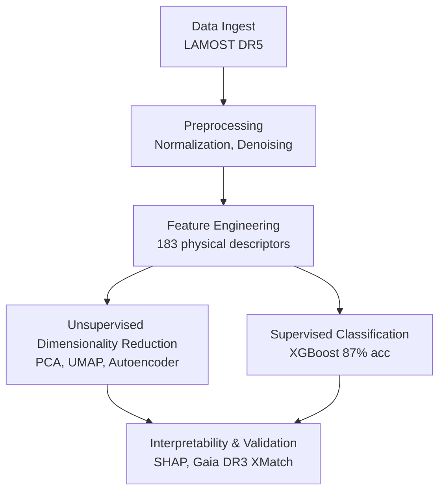

<div align="center">


<h1>✦ AstroSpectro Classification Pipeline ✦</h1>

<p><em>A modular, reproducible, and scientifically rigorous pipeline for automated stellar spectral classification<br/>from raw <strong>LAMOST DR5</strong> spectra × <strong>Gaia DR3</strong> — built by a physics undergraduate, for the community.</em></p>

<!-- Badges — row 1: stack -->
<p>
  <a href="https://www.python.org/"></a>
  <a href="https://xgboost.readthedocs.io/"></a>
  <a href="https://www.astropy.org/"></a>
  <a href="https://umap-learn.readthedocs.io/"></a>
  <a href="https://pytorch.org/"></a>
</p>

<!-- Badges — row 2: meta -->
<p>
  <a href="https://github.com/PhD-Brown/AstroSpectro/releases"></a>
  <a href="https://github.com/PhD-Brown/AstroSpectro/blob/main/LICENSE"></a>
  <a href="https://phd-brown.github.io/AstroSpectro/"></a>
  <a href="https://github.com/PhD-Brown/AstroSpectro/actions/workflows/deploy.yml"></a>
  <a href="https://github.com/PhD-Brown/AstroSpectro/commits/main"></a>
</p>

<!-- Badges — row 3: science metrics -->
<p>
  
  
  
  
  
</p>

<br/>

**[Full Documentation](https://phd-brown.github.io/AstroSpectro/)** &nbsp;·&nbsp;
**[Results Analysis](https://phd-brown.github.io/AstroSpectro/docs/science/results-analysis)** &nbsp;·&nbsp;
**[Roadmap](https://phd-brown.github.io/AstroSpectro/docs/community/roadmap)** &nbsp;·&nbsp;
**[Report a Bug](https://github.com/PhD-Brown/AstroSpectro/issues)** &nbsp;·&nbsp;
**[Contact](mailto:alex.baker.1@ulaval.ca)**

</div>

---

## Table of Contents

- [About the Project](#-about-the-project)
- [Key Results at a Glance](key-results-at-a-glance)
- [Scientific Contributions](scientific-contributions)
- [Pipeline Architecture](#️-pipeline-architecture)
- [Getting Started](getting-started)
  - [Option 1 — GitHub Codespaces (1-Click)](#option-1--github-codespaces-1-click)
  - [Option 2 — Local Installation](#option-2--local-installation)
- [Project Structure](project-structure)
- [Notebooks Walkthrough](#-notebooks-walkthrough)
- [Results](#-results)
- [Tech Stack](#️-tech-stack)
- [Roadmap](roadmap)
- [Contributing](contributing)
- [Citing AstroSpectro](citing-astrospectro)
- [License](license)
- [Contact](contact)
- [Acknowledgements](acknowledgements)

---

## 🌌 About the Project

**AstroSpectro** is a fully reproducible, end-to-end machine learning pipeline for automated stellar spectral classification. It processes raw FITS spectra from the [LAMOST DR5](http://www.lamost.org/public/) survey, cross-matches them with [Gaia DR3](https://www.cosmos.esa.int/web/gaia/dr3) astrometry and astrophysical parameters, engineers 183 physically motivated spectroscopic descriptors, and classifies stars using both **unsupervised dimensionality reduction** (PCA, UMAP, t-SNE, HDBSCAN, Autoencoder) and **supervised learning** (XGBoost with full SHAP interpretability).

This project was initiated as a second-year physics undergraduate research project at **Université Laval** (Québec City, Canada), with the long-term goal of contributing to peer-reviewed astrophysics literature. It is designed from the ground up for **transparency**, **scientific reproducibility**, and **community reuse**.

> **What makes it different?** Most classification pipelines stop at accuracy metrics. AstroSpectro goes further — it uses SHAP analysis to *validate that the model learned real stellar physics*, not survey artefacts. The central finding — that **metallicity indicators (Ca II H&K) outrank temperature indicators (Balmer lines) as discriminators** — challenges classical MK classification assumptions and constitutes an original scientific contribution.

### Highlights

<div align="center">
  
| | |
|---|---|
| **43,019 stellar spectra** | LAMOST DR5 × Gaia DR3 cross-matched at 1 arcsecond |
| **183 spectroscopic descriptors** | Physical features only — no metadata contamination (`spectro_only=True`) |
| **87% balanced accuracy** | XGBoost on 5 spectral classes (A, F, G, K, M) |
| **SHAP-validated physics** | 97.9% of top-30 features are physically meaningful spectral lines |
| **20 unsupervised clusters** | HDBSCAN on UMAP recovers dwarf/giant separation without labels |
| **~340k spectra/hour** | joblib-parallelized FITS processing on 16-core CPU |
| **85+ W&B tracked experiments** | Full reproducibility with Weights & Biases |

</div>

---

## Key Results at a Glance

<div align="center">

| Metric | Value | Method |
|:-------|:-----:|:-------|
| Balanced Accuracy | **87%** | XGBoost · `spectro_only=True` |
| ROC-AUC (macro) | **~0.964** | 5-class one-vs-rest |
| Median Confidence | **96.3%** | XGBoost predicted probability |
| M-star F1 | **0.960** | Best per-class score |
| ρ(PC1, T_eff) | **+0.831** | Spearman · PCA vs Gaia GSP-Phot |
| HDBSCAN clusters | **20** | On UMAP embedding · 6.14% noise |
| t-SNE vs UMAP stability | **~60×** | Procrustes distance ratio |
| SHAP top-30 physical features | **97.9%** | No metadata leakage |
| PCA → 95% variance | **91 components** | On 183 standardized descriptors |
| Flux PCA → 91.3% variance | **3 components** | On 3,921 raw flux channels |

</div>

---

## Scientific Contributions

### Central Finding — Ca II beats Balmer for Classification

The SHAP analysis of the `spectro_only=True` XGBoost model reveals that the **top 5 discriminating features are all Ca II H&K lines** — not the Balmer series traditionally emphasized in the MK spectral classification scheme.

### SHAP Top-10 Features (run 20260213T225019Z)

<div align="center">
  
| Rank | Descriptor | Importance | SHAP Value | Family |
|:---:|:---|:---:|:---|:---|
| 🥇 **1** | **Ca II K** - prominence | `0.98` | ██████████ | 🟣 Ca II H&K |
| 🥈 **2** | **Ca II K** - equivalent width | `0.94` | █████████░ | 🟣 Ca II H&K |
| 🥉 **3** | **Ca II K** - FWHM | `0.91` | █████████░ | 🟣 Ca II H&K |
| **4** | **Ca II H** - prominence | `0.87` | ████████▊░ | 🟣 Ca II H&K |
| **5** | **Ca II H** - equivalent width | `0.84` | ████████▎░ | 🟣 Ca II H&K |
| **6** | **Hα** - equivalent width | `0.78` | ███████▊░░ | 🔴 Balmer |
| **7** | **Hα** - prominence | `0.74` | ███████▍░░ | 🔴 Balmer |
| **8** | **Mg b** - equivalent width | `0.68` | ██████▊░░░ | 🪨 Metals |
| **9** | **Mg b** - prominence | `0.64` | ██████▍░░░ | 🪨 Metals |
| **10** | **Balmer Temperature Index**| `0.58` | █████▊░░░░ | 🔴 Balmer |

</div>

> **Interpretation:** PCA answers *"what explains the most variance?"* → Temperature (Balmer lines, PC1). XGBoost answers *"what separates the classes best?"* → Metallicity (Ca II H&K). These are complementary, consistent results — both converge on the same physical structure, validating the 183-descriptor space.

### Unsupervised Structure — Harvard Sequence Without Labels

UMAP applied to 91 PCA components (95% variance) spontaneously reproduces the classical Harvard spectral sequence (M → K → G → F → A) as a **continuous manifold**, with the dwarf/giant luminosity class bifurcation emerging as a topological feature. HDBSCAN then recovers 20 clusters where the sub-giant branch (clusters C1, C12, C19) is physically identified by enhanced Ca II and suppressed Balmer lines — a direct spectroscopic signature of lower surface gravity.

**A negative-control test** (UMAP on column-permuted data) confirms this structure is of **physical origin**, not an algorithmic artefact.


*Fig. 1: Analyse détaillée de l'importance SHAP cumulative par famille de descripteurs physiques. On note la domination écrasante du Calcium II (Ca II) sur la série de Balmer, confirmant le "Central Finding" de l'étude.*

### Pipeline Evolution — From 32% to 87%



> **Counter-intuitive key lesson:** Accuracy *increased* from 84% to 87% by *removing* features (`ra`, `dec`, `redshift`). These carried spurious signal from LAMOST's sky-program targeting biases — not stellar physics. Their removal forces the model to generalise on intrinsic spectral information.

---

## 🏗️ Pipeline Architecture



---

## Getting Started

### Option 1 — GitHub Codespaces (1-Click)

The fastest way to run AstroSpectro — no local setup required. Everything is pre-configured.

1. Click **`<> Code`** at the top of this page
2. Go to the **`Codespaces`** tab
3. Click **`Create codespace on main`**

[](https://github.com/codespaces/new?hide_repo_select=true&ref=main&repo=1015730251)

Once loaded, open `notebooks/00_master_pipeline.ipynb` and follow along.

> 💡 **Tip:** Change the URL suffix from `.../` to `.../editor=jupyter` for a classic Jupyter interface instead of VS Code.

---

### Option 2 — Local Installation

#### Prerequisites

- **Python 3.11.x** (required — other versions not tested)
- **Git**
- *(Optional)* NVIDIA GPU with CUDA for autoencoder training (RTX 3060 Ti or better recommended)

#### Step-by-step

**1. Clone the repository**

```bash
git clone https://github.com/PhD-Brown/AstroSpectro.git
cd AstroSpectro
```

**2. Create a virtual environment**

```bash
# Windows (PowerShell)
py -3.11 -m venv .venv
.\.venv\Scripts\Activate.ps1
# If blocked: Set-ExecutionPolicy -Scope Process -ExecutionPolicy Bypass

# macOS / Linux
python3.11 -m venv .venv
source .venv/bin/activate
```

**3. Install AstroSpectro and all dependencies**

```bash
python -m pip install --upgrade pip
python -m pip install -e . -r requirements.txt
```

**4. Register the Jupyter kernel**

```bash
python -m ipykernel install --user \
  --name astrospectro \
  --display-name "AstroSpectro (Py3.11)"
```

**5. Configure credentials** *(optional — anonymous access works for most tasks)*

```bash
# Windows
copy .env.example .env

# macOS / Linux
cp .env.example .env
```

Open `.env` and fill in `WANDB_API_KEY` (for experiment tracking) and optionally `GAIA_USER` / `GAIA_PASS`.

**6. Launch the master pipeline**

Open `notebooks/00_master_pipeline.ipynb` in Jupyter or VS Code, select the **`AstroSpectro (Py3.11)`** kernel, and follow the cells.

Detailed walkthrough: **[First Run Tutorial](https://phd-brown.github.io/AstroSpectro/docs/getting-started/first-run)**

---

## Project Structure

```
AstroSpectro/
│
├── notebooks/                       # Jupyter orchestration layer (lightweight)
│   ├── 00_master_pipeline.ipynb        # ← Entry point: full pipeline run
│   ├── 01_download_spectra.ipynb       # LAMOST DR5 FITS bulk download
│   ├── 02_tools_and_visuals.ipynb      # Exploratory figures & EDA
│   ├── 03_scientific_validation.ipynb  # Gaia HR diagram cross-validation
│   ├── 04_shap_interpretability.ipynb  # SHAP figures & Ca II finding
│   └── dimred/
│       ├── phy3500_01_pca.ipynb        # NB01 — PCA · eigenspectra · loadings
│       ├── phy3500_02_umap_tsne.ipynb  # NB02 — UMAP · t-SNE · HDBSCAN · Procrustes
│       └── phy3500_03_autoencoder.ipynb# NB03 — Conv AE · reconstruction · latent space
│
├── src/
│   ├── pipeline/                       # Core pipeline modules
│   │   ├── data_loader.py              # FITS ingestion · spectro_only flag
│   │   ├── preprocessor.py             # Normalization · continuum · denoising
│   │   ├── peak_detector.py            # Line ID: Hα, Hβ, Ca II H&K, Mg b, Na D
│   │   ├── feature_engineering.py      # 183-descriptor builder
│   │   ├── classifier.py               # XGBoost · BalancedBaggingClassifier
│   │   ├── processing.py               # joblib parallel batch processor
│   │   ├── generate_catalog_from_fits.py  # Full FITS → CSV catalog build
│   │   ├── gaia_crossmatcher.py        # CDS XMatch · Gaia DR3 GSP-Phot columns
│   │   └── master.py                   # Top-level orchestrator
│   │
│   └── dimred/                         # Dimensionality reduction package
│       ├── __init__.py
│       ├── data_loader.py              # Shared data loading (spectro_only)
│       ├── pca_analyzer.py             # PCA · eigenspectra · loadings heatmap
│       ├── embedding.py                # UMAP · t-SNE · Procrustes stability
│       ├── autoencoder.py              # Conv AE (PyTorch) · MSE by class
│       ├── hdbscan_analyzer.py         # HDBSCAN · cluster profiling · HR labels
│       ├── dimred_visualizer.py        # Plotly (interactive 3D) · matplotlib engine
│       ├── run_reporter.py             # JSON / TXT run reports
│       └── xgboost_bridge.py           # UMAP overlay · SHAP bridge
│
├── data/
│   ├── raw/                            # FITS files (gitignored)
│   ├── processed/                      # Feature CSVs (gitignored)
│   └── reports/                        # W&B run exports · model metadata JSONs
│
├── website/                         # Docusaurus documentation site
│   └── docs/                           # 13 MDX pages · API reference · guides
│
├── .github/workflows/
│   └── deploy.yml                      # Docusaurus → GitHub Pages auto-deploy
│
├── .devcontainer/                      # GitHub Codespaces devcontainer config
├── .env.example                        # Credentials template
├── pyproject.toml                      # Package metadata
├── requirements.txt                    # Pinned dependencies
├── ROADMAP.md                          # Detailed development roadmap
└── README.md
```

---

## 🧪 Notebooks Walkthrough

<div align="center">
  
| Notebook | Description | Key Output |
|:---------|:------------|:-----------|
| `00_master_pipeline.ipynb` | **Entry point** — orchestrates all pipeline stages end-to-end | Full run log |
| `01_download_spectra.ipynb` | Bulk LAMOST DR5 FITS download via validated plan URLs | ~139k FITS files |
| `02_tools_and_visuals.ipynb` | EDA · SNR analysis · color-color diagrams · spectra gallery | Exploratory figures |
| `03_scientific_validation.ipynb` | Gaia DR3 cross-match · HR diagram · physical validation | Validation plots |
| `04_shap_interpretability.ipynb` | SHAP beeswarm · per-class feature importance · Ca II finding | SHAP figures |
| `dimred/NB01` — PCA | Variance spectrum · eigenspectra · loadings heatmap · HR (PC1) | 6 publication figures |
| `dimred/NB02` — UMAP/t-SNE | Embedding · Procrustes stability · HDBSCAN 20 clusters | 10 publication figures |
| `dimred/NB03` — Autoencoder | Conv AE training · reconstruction MSE by class · latent arithmetic | 8 publication figures |

</div>

---

## 📊 Results

### Classification — XGBoost (`spectro_only=True`)

```
              Balanced Accuracy : 87.0 %
              ROC-AUC (macro)   : ~0.964
              Median Confidence : 96.3 %

 Class  │  Precision  │  Recall  │  F1-Score  │  Physical Note
────────┼─────────────┼──────────┼────────────┼──────────────────────────────
   A    │    80.8 %   │  82.4 %  │   81.6 %   │ Wide Balmer — hot stars
   F    │    79.3 %   │  73.5 %  │   76.3 %   │ Transition region F/G
   G    │    79.9 %   │  80.7 %  │   80.3 %   │ Solar-type, Ca II rising
   K    │    83.9 %   │  87.8 %  │   85.8 %   │ Strong Ca II H&K dominant
   M    │    96.3 %   │  95.6 %  │   96.0 %   │ TiO/VO molecular bands
```

> **F/G confusion is astrophysically expected.** The 5,500–6,200 K boundary is a continuous physical transition, not a discrete step. The pipeline correctly identifies this as a region of intrinsic ambiguity rather than a model failure.

### Dimensionality Reduction — Comparative Summary

<div align="center">
  
| Method | ρ(axis 1, T_eff) | Stability (Procrustes d_P) | CPU time | Interpretable axes |
|:-------|:-----------------:|:--------------------------:|:--------:|:------------------:|
| **PCA** | **+0.831** | Exact (deterministic) | <1 s | Yes |
| **UMAP** | +0.464 | 3.0 × 10⁻² | 40.1 s | No |
| **t-SNE** | +0.623 | **5.0 × 10⁻⁴** (~60× more stable than UMAP) | 80.2 s | No |

</div>

> **Counter-intuitive stability result:** `init='pca'` in t-SNE fixes an identical starting configuration across runs. The KL divergence penalty is predominantly local — large-scale topology is largely seed-independent — making t-SNE ~60× more reproducible than UMAP on this dataset.

---

## 🛠️ Tech Stack

<div align="center">

| Layer | Technology |
|:------|:-----------|
| **Language** | Python 3.11 |
| **ML / Classification** | XGBoost 3.1.1 · scikit-learn 1.7.2 · BalancedBaggingClassifier |
| **Deep Learning** | PyTorch (Convolutional Autoencoder) |
| **Dimensionality Reduction** | UMAP-learn · scikit-learn (PCA, t-SNE) |
| **Clustering** | HDBSCAN |
| **Astronomy** | Astropy 6.0.0 · astroquery |
| **Astrometry Cross-match** | Gaia DR3 via CDS XMatch (`vizier:I/355/gaiadr3`) |
| **Interpretability** | SHAP (SHapley Additive exPlanations) |
| **Experiment Tracking** | Weights & Biases (85+ logged runs) |
| **Hyperparameter Tuning** | Optuna *(in progress)* |
| **Parallelization** | joblib (~340k spectra/hour · 16-core Ryzen 9) |
| **Visualization** | Plotly (interactive 3D) · Matplotlib · Seaborn |
| **Documentation** | Docusaurus v3 · MDX (13 pages) |
| **Dev Environment** | GitHub Codespaces · VS Code devcontainer |
| **Hardware** | Ryzen 9 5950X · RTX 3060 Ti · 64 GB RAM |

</div>

> **⚠️ Note on ESA Gaia TAP:** Upload-based TAP queries to the ESA endpoint were confirmed broken as of late 2025. **CDS XMatch** (`astroquery.xmatch.XMatch`) against VizieR `vizier:I/355/gaiadr3` is the robust alternative used throughout this project and is recommended for any LAMOST × Gaia cross-match workflow.

---

## Roadmap

- [x] LAMOST DR5 bulk download + FITS catalog builder
- [x] 183-descriptor physical feature engineering (`spectro_only=True`)
- [x] XGBoost classification · 87% balanced accuracy · ROC-AUC ~0.964
- [x] SHAP interpretability · Ca II H&K central finding
- [x] PCA · UMAP · t-SNE · HDBSCAN · Procrustes stability
- [x] PyTorch convolutional autoencoder
- [x] Gaia DR3 cross-match (CDS XMatch · 1 arcsecond)
- [x] W&B experiment tracking (85+ runs)
- [x] Docusaurus documentation site (13 MDX pages, CI/CD)
- [ ] **Optuna hyperparameter optimization at full scale** *(in progress)*
- [ ] Process remaining ~139k FITS files
- [ ] HDBSCAN cluster characterization against external catalogues (variables, RGB, SB2)
- [ ] Anomaly detection: HDBSCAN noise ∩ top-1% AE reconstruction MSE
- [ ] Extension to LAMOST DR10 or SDSS (~10⁷ spectra scale)
- [ ] Journal submission — *A&A* or *MNRAS*

→ See the [full roadmap](https://phd-brown.github.io/AstroSpectro/docs/community/roadmap) for details and timeline.

---

## Contributing

Contributions, questions, and collaborations are warmly welcome — especially from astronomers, ML practitioners, or fellow students.

1. **Fork** the repository and clone your fork
2. **Create a branch** (`git checkout -b feature/my-contribution`)
3. **Commit** your changes with descriptive messages
4. **Push** and open a **Pull Request** — describe what changed and why

Please read the **[Contribution Guide](https://phd-brown.github.io/AstroSpectro/docs/community/contributing)** before submitting.
For questions or ideas, open a [Discussion](https://github.com/PhD-Brown/AstroSpectro/discussions) — I respond to everything.

---

## Citing AstroSpectro

If you use AstroSpectro in your research or coursework, please cite it as:

```bibtex
@software{baker2026astrospectro,
  author    = {Baker, Alex},
  title     = {{AstroSpectro}: A Modular Pipeline for Automated Stellar
               Spectral Classification from LAMOST DR5 and Gaia DR3},
  year      = {2026},
  version   = {1.0.0},
  url       = {https://github.com/PhD-Brown/AstroSpectro},
  note      = {Université Laval, Département de physique, génie physique et optique}
}
```

See the **[Citation Guide](https://phd-brown.github.io/AstroSpectro/docs/community/citing)** for how to also credit LAMOST and Gaia properly.

---

## License

Distributed under the **MIT License**. See [`LICENSE`](https://github.com/PhD-Brown/AstroSpectro/blob/main/LICENSE) for details.

You are free to use, modify, and distribute this code for any purpose — academic, commercial, or personal — as long as the original license and copyright notice are retained.

---

## Contact

**Alex Baker** — Physics undergraduate, Université Laval (Québec City, Canada)

- Email: [alex.baker.1@ulaval.ca](mailto:alex.baker.1@ulaval.ca)
- GitHub: [@PhD-Brown](https://github.com/PhD-Brown)
- Docs: [phd-brown.github.io/AstroSpectro](https://phd-brown.github.io/AstroSpectro/)

Feel free to reach out for collaborations, methodology questions, or graduate research discussions.

---

## Acknowledgements

- **[LAMOST](http://www.lamost.org/public/)** — Large Sky Area Multi-Object Fiber Spectroscopic Telescope, for providing the DR5 dataset that makes this project possible.
- **[Gaia DR3](https://www.cosmos.esa.int/web/gaia/dr3)** — ESA Gaia mission, for astrometry and astrophysical parameters (GSP-Phot: T_eff, log g, [Fe/H], distance, A_G).
- **[CDS / VizieR](https://vizier.cds.unistra.fr/)** — Centre de Données astronomiques de Strasbourg, for the robust cross-matching service.
- **[Astropy Project](https://www.astropy.org/)** — The community-developed core Python package for astronomy.
- **[Weights & Biases](https://wandb.ai/)** — For experiment tracking and model reproducibility.
- **Prof. Antoine Allard** (Université Laval) — PHY-3500 course supervision and encouragement.
- **Prof. Carmelle Robert** (Université Laval) — Scientific mentorship and guidance in stellar astrophysics.
- **Laurent Drissen** (Université Laval / SIGNALS) — For the inspiring discussions on spectral imaging.

---

<div align="center">

<br/>

*Built with curiosity, a Ryzen 9, and way too many W&B runs* ☕🔭

<br/>

**[⬆ Back to top](#-astrospectro-classification-pipeline-)**

<br/>


&nbsp;

&nbsp;


<br/><br/>

*Copyright © 2026 Alex Baker — MIT License*

</div>
