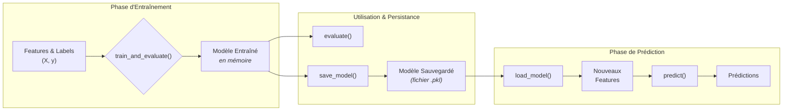

<!-- Complet for v0.1.0-alpha release -->

import { FontAwesomeIcon } from '@fortawesome/react-fontawesome'
import { faBrain, faFileCode, faObjectGroup, faBook, faSave, faDownload, faExclamationTriangle, faInfoCircle, faProjectDiagram, faQuestionCircle } from '@fortawesome/free-solid-svg-icons'
import Admonition from '@theme/Admonition';

# <FontAwesomeIcon icon={faBrain} /> `classifier.py`

Ce module contient la classe `SpectralClassifier`, qui est le "cerveau" du pipeline. Elle encapsule un modèle de Machine Learning pour réaliser la classification à partir des features extraites.

## <FontAwesomeIcon icon={faProjectDiagram} /> Workflow de la Classification

## <FontAwesomeIcon icon={faObjectGroup} /> Classe SpectralClassifier
> Cette classe fournit une interface simple pour entraîner, évaluer, et gérer la persistance d'un modèle de classification.

Détails sur l'instanciation et la configuration

- **Description :** Crée une instance du classifieur. Le modèle par défaut est un <code>RandomForestClassifier</code> de scikit-learn.
 - **Arguments :**
<ul>
<li><code>n_estimators</code> (int, défaut: 100) : Le nombre d'arbres dans la forêt.</li>
<li><code>random_state</code> (int, défaut: 42) : Pour garantir la reproductibilité des résultats.</li>
</ul>
- **Attributs Notables :**
<ul>
<li><code>class_weight='balanced'</code> : Le modèle ajuste automatiquement le poids des classes pour compenser les déséquilibres dans le jeu de données.</li>
</ul>

## Bonnes Pratiques & Limites

<Admonition type="tip" title="Bonnes Pratiques" icon="💡">
<ul>
<li>Fixez toujours le <code>random_state</code> pour des expériences reproductibles.</li>
<li>Validez systématiquement les performances sur un jeu de test qui n'a pas servi à l'entraînement.</li>
<li>Sauvegardez non seulement le modèle, mais aussi la version du code et les paramètres de prétraitement pour une traçabilité complète.</li>
</ul>
</Admonition>

<Admonition type="danger" title="Limites & Cas Limites" icon="☢️">
<ul>
<li>Pour des jeux de données très petits, les performances peuvent varier fortement entre deux exécutions.</li>
<li>Random Forest est robuste, mais si vos features sont très corrélées, sa performance peut être affectée.</li>
<li>Pour des déséquilibres de classes extrêmes, explorer des techniques de ré-échantillonnage (ex: SMOTE) en plus de <code>class_weight</code> peut être bénéfique.</li>
</ul>
</Admonition>

## <FontAwesomeIcon icon={faBook} /> Méthodes Principales

### ``train_and_evaluate(X, y, test_size=0.25)``

> C'est la méthode "tout-en-un" pour un workflow standard.

- **Rôle :** Prend une matrice de features X et un vecteur de labels y, les sépare en ensembles d'entraînement/test, entraîne le modèle, et affiche un rapport d'évaluation complet.
- **Arguments :``
  - X (array-like) : La matrice des features.
  - y (array-like) : Le vecteur des labels correspondants.
  - test_size (float, défaut: 0.25) : La proportion du dataset à réserver pour le test.

### ``train(X_train, y_train)``

- **Rôle :** Entraîne le modèle uniquement sur les données fournies. Utile pour des schémas de validation plus complexes (ex: validation croisée manuelle).

### ``evaluate(X_test, y_test)``
- **Rôle :** Évalue le modèle déjà entraîné sur un jeu de test et affiche le rapport de classification et la matrice de confusion.

## <FontAwesomeIcon icon={faQuestionCircle} /> Questions Fréquentes (FAQ)

Puis-je utiliser un autre modèle que Random Forest ?

<strong>Oui, absolument.</strong> La classe <code>SpectralClassifier</code> a été conçue pour être modulaire. Il vous suffirait de modifier la ligne <code>self.model = RandomForestClassifier(...)</code> dans le constructeur <code>__init__</code> pour utiliser un autre classifieur de scikit-learn (comme <code>SVC</code>, <code>XGBClassifier</code>, etc.), tout en conservant le reste de l'interface (<code>train</code>, <code>evaluate</code>...).

Comment utiliser un modèle déjà entraîné pour prédire sur de nouvelles données ?

C'est exactement le but de <code>save_model</code> et <code>load_model</code>. Le workflow est le suivant :

<ol>
<li>Chargez le modèle avec <code>loaded_clf = SpectralClassifier.load_model("path/to/model.pkl")</code>.</li>
<li>Préparez vos nouvelles données pour obtenir une matrice de features <code>X_new</code>.</li>
<li>Faites la prédiction avec <code>predictions = loaded_clf.model.predict(X_new)</code>.</li>
</ol>

<Admonition type="info" title="Liens & Références Utiles" icon={<FontAwesomeIcon icon={faInfoCircle} />}>
<ul>
<li><a href="https://scikit-learn.org/stable/modules/generated/sklearn.ensemble.RandomForestClassifier.html" target="_blank">Documentation de <code>RandomForestClassifier</code></a></li>
<li><a href="https://joblib.readthedocs.io/en/latest/persistence.html" target="_blank">Documentation de <code>Joblib</code> pour la persistance des modèles</a></li>
</ul>
</Admonition>

