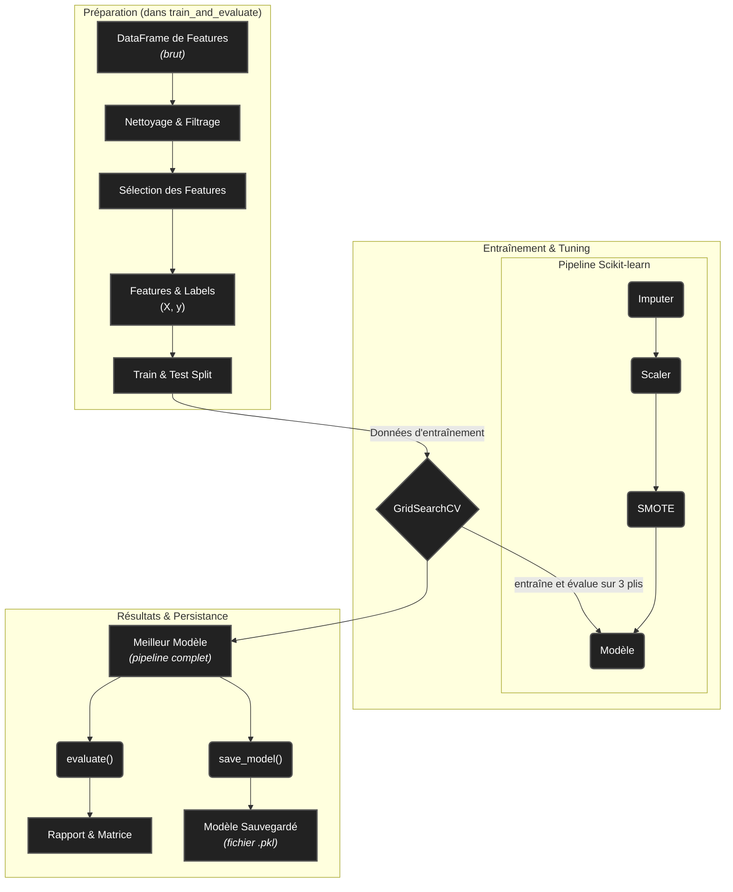

<!-- Complet for v1.0.0 release -->

import { FontAwesomeIcon } from '@fortawesome/react-fontawesome'
import { faBrain, faFileCode, faObjectGroup, faBook, faSave, faExclamationTriangle, faInfoCircle, faProjectDiagram, faQuestionCircle } from '@fortawesome/free-solid-svg-icons'
import Admonition from '@theme/Admonition';

# <FontAwesomeIcon icon={faBrain} /> `classifier.py`

Ce module contient la classe [`SpectralClassifier`](https://github.com/PhD-Brown/AstroSpectro/blob/main/src/pipeline/classifier.py), qui est le "cerveau" du pipeline. Elle encapsule un pipeline de Machine Learning complet pour réaliser la classification à partir des *features* extraites.

## <FontAwesomeIcon icon={faProjectDiagram} /> Workflow de la Classification

Le workflow géré par la classe est beaucoup plus qu'un simple entraînement. Il s'agit d'un processus rigoureux de préparation, d'optimisation et d'évaluation.

## <FontAwesomeIcon icon={faObjectGroup} /> Classe ``SpectralClassifier``

> Cette classe fournit une interface de haut niveau pour entraîner, optimiser, évaluer et gérer la persistance d'un modèle de classification.

Détails sur l'instanciation et la configuration

- **Description :** Crée une instance du classifieur.
- **Arguments :**
- `model_type` (str, défaut: 'RandomForest') : Le type de modèle à utiliser. Peut être 'RandomForest' ou 'XGBoost'.
- `random_state` (int, défaut: 42) : Pour garantir la reproductibilité des résultats.

### <FontAwesomeIcon icon={faInfoCircle} /> Bonnes Pratiques & Points Clés

<Admonition type="tip" title="Ce qui est Inclus" icon="💡">
<ul>
<li><strong>Pipeline Intégré :</strong> L'utilisation d'un <code>Pipeline</code> garantit que le scaling et l'imputation sont appris uniquement sur les données d'entraînement, évitant les fuites de données.</li>
<li><strong>Validation Croisée :</strong> <code>GridSearchCV</code> utilise une validation croisée stratifiée pour une évaluation robuste et un choix de paramètres fiable.</li>
<li><strong>Gestion du Déséquilibre :</strong> L'étape <code>SMOTE</code> est appliquée à la volée pendant l'entraînement pour corriger le déséquilibre des classes sans polluer le jeu de test.</li>
</ul>
</Admonition>

<Admonition type="danger" title="Ce qui est Géré" icon="☢️">
<ul>
<li><strong>Données Manquantes :</strong> Les <code>NaN</code> dans les <em>features</em> (ex: FWHM non calculable) sont automatiquement remplacés par zéro grâce à <code>SimpleImputer</code>.</li>
<li><strong>Labels Invalides :</strong> Les spectres sans <code>subclass</code> valide sont automatiquement exclus.</li>
<li><strong>Classes Rares :</strong> Les classes avec moins de 10 échantillons sont retirées pour garantir la stabilité de l'entraînement et de l'évaluation.</li>
</ul>
</Admonition>

### <FontAwesomeIcon icon={faQuestionCircle} /> Questions Fréquentes (FAQ)

Comment puis-je utiliser un modèle déjà entraîné pour prédire sur de nouvelles données ?

Le workflow est simple :

<ol>
<li>Chargez l'objet classifieur complet avec <code>loaded_clf = SpectralClassifier.load_model("path/to/model.pkl")</code>.</li>
<li>Préparez vos nouvelles données sous forme d'un DataFrame <code>pandas</code> contenant les mêmes colonnes de <em>features</em> que lors de l'entraînement.</li>
<li>Faites la prédiction avec <code>predictions = loaded_clf.model_pipeline.predict(X_new)</code>. Le <code>model_pipeline</code> s'occupera automatiquement du scaling et de l'imputation.</li>
</ol>

<Admonition type="info" title="Liens & Références Utiles" icon={<FontAwesomeIcon icon={faInfoCircle} />}>
<ul>
<li><a href="https://scikit-learn.org/stable/modules/generated/sklearn.ensemble.RandomForestClassifier.html" target="_blank">Documentation de <code>RandomForestClassifier</code></a></li>
<li><a href="https://joblib.readthedocs.io/en/latest/persistence.html" target="_blank">Documentation de <code>Joblib</code> pour la persistance des modèles</a></li>
</ul>
</Admonition>

