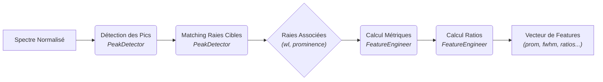

<!-- Complet for v1.0.0 release -->

import { FontAwesomeIcon } from '@fortawesome/react-fontawesome'
import { faWandSparkles, faFileCode, faObjectGroup, faBook, faArrowRight, faCogs, faCubes } from '@fortawesome/free-solid-svg-icons'
import Admonition from '@theme/Admonition';

## <FontAwesomeIcon icon={faCubes} /> `peak_detector.py` & `feature_engineer.py`

Cette étape est le cœur de l'approche "physique" du pipeline. Elle est gérée par deux modules qui travaillent en tandem : [`PeakDetector`](https://github.com/PhD-Brown/AstroSpectro/blob/main/src/pipeline/peak_detector.py) et [`FeatureEngineer`](https://github.com/PhD-Brown/AstroSpectro/blob/main/src/pipeline/feature_engineering.py). Leur rôle combiné est de transformer un spectre normalisé en un vecteur de *features* numériques.

### <FontAwesomeIcon icon={faCogs} /> Workflow du Traitement

<div style={{textAlign: 'center', backgroundColor: 'var(--ifm-background-color-secondary)', padding: '1rem', borderRadius: 'var(--ifm-card-border-radius)'}}>


</div>

1.  **`PeakDetector`** : Identifie les raies d'absorption.
2.  **`FeatureEngineer`** : Convertit ces détections en un vecteur numérique.

## <FontAwesomeIcon icon={faObjectGroup} /> Classe `PeakDetector`

Cette classe recherche les minima locaux significatifs dans un spectre et les associe à des raies spectrales connues.

<details>
<summary>Détails des attributs et de la configuration</summary>
<div>
<p>Le <code>PeakDetector</code> est initialisé avec des paramètres qui contrôlent sa sensibilité. Ces valeurs ont été optimisées par analyse visuelle interactive.</p>
<ul>
<li><strong><code>prominence</code></strong> : Seuil de profondeur minimale pour qu'un pic soit considéré comme significatif. C'est le paramètre le plus important pour filtrer le bruit. Et est hérité de <a href="https://docs.scipy.org/doc/scipy/reference/generated/scipy.signal.find_peaks.html" target="_blank">scipy.signal.find_peaks</a>.</li>
<li><strong><code>window</code></strong> : Fenêtre de tolérance (en Ångström) autour d'une raie théorique pour le matching.</li>
<li><strong><code>target_lines</code></strong> : Un dictionnaire des 6 raies astrophysiques que nous cherchons : <strong>Hα, Hβ, CaII K, CaII H, Mg_b, et Na_D</strong>.</li>
</ul>
</div>
</details>

### Méthodes Principales

#### `analyze_spectrum(wavelength, flux)`
-   **Rôle :** Orchestre le processus complet en appelant d'abord ``detect_peaks`` puis ``match_known_lines``.
-   **Retourne :** Un dictionnaire associant chaque nom de raie cible à un tuple ``(longueur_d_onde, prominence)`` si un pic a été trouvé, ou ``None`` sinon. C'est la sortie principale de ce module.

## <FontAwesomeIcon icon={faObjectGroup} /> Classe `FeatureEngineer`

Cette classe prend le dictionnaire de raies du ``PeakDetector`` et le transforme en un vecteur de *features riche* et prêt pour le Machine Learning.

### Méthodes Principales

#### `extract_features(matched_lines, wavelength, flux_norm)`
-   **Rôle :** Convertit les détections en un vecteur numérique multi-dimensionnel.
-   **Logique :** Pour chaque raie cible, elle calcule plusieurs métriques physiques :
    1. **Prominence (Force) :** La profondeur de la raie, directement issue du PeakDetector.
    2. **Largeur (FWHM) :** La "Largeur à Mi-Hauteur", calculée avec ``specutils`` sur une version lissée (Savitzky-Golay) de la raie.
    3. **(Expérimental) Skewness :** L'asymétrie de la raie. (Actuellement retiré car non informatif).
-   **Ratios :** Elle calcule ensuite des ratios entre les prominences de différentes raies (ex: CaII K / Hβ) pour créer des features de température.
-   **Retourne :** Une liste de features numériques (plus de 15 *features* au total).

## <FontAwesomeIcon icon={faBook} /> Exemples & Bonnes Pratiques

Ce snippet montre comment les deux classes travaillent ensemble.

```python title="Python title="Workflow pour un spectre"
# ... à l'intérieur de la boucle du ProcessingPipeline ...

# 1. Détection et matching des raies
matched_lines = peak_detector.analyze_spectrum(wavelength, flux_norm)

# 2. Vectorisation et enrichissement
features_vector = feature_engineer.extract_features(matched_lines, wavelength, flux_norm)
# Résultat : un vecteur de 15+ features [prom_Hα, fwhm_Hα, prom_Hβ, ..., ratio_CaK_Hb, ...]
```

<div className="container" style={{padding: '0', marginTop: '2rem'}}>
<div className="row">
<div className="col col--6">
<Admonition type="tip" title="Bonnes Pratiques" icon="💡">
<ul>
<li><strong>Normalisation d'abord :</strong> Toujours appliquer le prétraitement et la normalisation <em>avant</em> de détecter les pics.</li>
<li><strong>Tuning des Paramètres :</strong> Les valeurs de <code>prominence</code> et <code>window</code> ont un impact majeur. Elles ont été optimisées grâce à l'outil de visualisation interactif.</li>
</ul>
</Admonition>
</div>
<div className="col col--6">
<Admonition type="danger" title="Cas Limites & Erreurs" icon="☢️">
<ul>
<li>Si une raie n'est pas trouvée, ses <em>features</em> associées (prominence, FWHM) sont mises à <strong>zéro</strong>.</li>
<li>Les calculs de FWHM peuvent échouer sur des spectres très bruités. Ces cas sont gérés et les <em>features</em> sont également mises à zéro.</li>
</ul>
</Admonition>
</div>
</div>
</div>
<div className="card">
<div className="card__header" style={{display: 'flex', alignItems: 'center', gap: '0.5rem'}}>
<FontAwesomeIcon icon={faArrowRight} />
<h3>Prochaine Étape du Pipeline</h3>
</div>
<div className="card__body">
<p>Une fois le vecteur de features obtenu, il est prêt à être utilisé pour entraîner un modèle.</p>
</div>
<div className="card__footer">
<a href="./classifier" className="button button--primary button--block">
→ Voir le Module Classifier
</a>
</div>
</div>