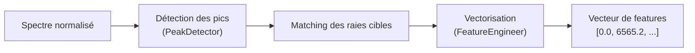

<!-- Complet for v0.1.0-alpha release -->

import { FontAwesomeIcon } from '@fortawesome/react-fontawesome'
import { faWandSparkles, faFileCode, faObjectGroup, faBook, faArrowRight, faExclamationTriangle, faCogs, faCubes } from '@fortawesome/free-solid-svg-icons'
import Admonition from '@theme/Admonition';

## <FontAwesomeIcon icon={faCubes} /> `peak_detector.py` & `feature_engineering.py`

Cette étape est le cœur de l'approche "physique" du pipeline. Elle est gérée par deux modules qui travaillent en tandem : `peak_detector.py` et `feature_engineering.py`. Leur rôle combiné est de transformer un spectre normalisé en un vecteur de features numériques.

### <FontAwesomeIcon icon={faCogs} /> Workflow du Traitement

<div style={{textAlign: 'center', backgroundColor: 'var(--ifm-background-color-secondary)', padding: '1rem', borderRadius: 'var(--ifm-card-border-radius)'}}>


</div>


1.  **`PeakDetector`** : Identifie les raies d'absorption.
2.  **`FeatureEngineer`** : Convertit ces détections en un vecteur numérique.

## <FontAwesomeIcon icon={faObjectGroup} /> Classe `PeakDetector`

Cette classe recherche les minima locaux significatifs dans un spectre et les associe à des raies spectrales connues.

<details>
<summary>Détails des attributs et de la configuration</summary>
<div>
<p>Le <code>PeakDetector</code> est initialisé avec des paramètres par défaut qui contrôlent sa sensibilité :</p>
<ul>
<li><strong><code>prominence</code></strong> (défaut: 1.4) : C'est le paramètre le plus important, hérité de <a href="https://docs.scipy.org/doc/scipy/reference/generated/scipy.signal.find_peaks.html" target="_blank">scipy.signal.find_peaks</a>. Il définit l'amplitude minimale qu'un pic doit avoir par rapport à son entourage pour être considéré comme significatif. Une faible valeur détectera plus de pics (potentiellement du bruit), une valeur élevée ne gardera que les raies les plus profondes.</li>
<li><strong><code>window</code></strong> (défaut: 30 Å) : Définit la fenêtre de tolérance autour d'une raie théorique pour le matching.</li>
<li><strong><code>target_lines</code></strong> : Un dictionnaire des raies que nous cherchons (Hα, Hβ, CaII K, CaII H), choisies pour leur fort pouvoir discriminant dans la classification stellaire.</li>
</ul>
</div>
</details>

### Méthodes Principales

#### `detect_peaks(wavelength, flux)`
-   **Rôle :** Détecte tous les minima locaux (pics d'absorption) dans le spectre.
-   **Logique :** Utilise `scipy.signal.find_peaks` sur le flux inversé (`-flux`).
-   **Retourne :** Les indices des pics détectés.

#### `match_known_lines(peak_wavelengths)`
-   **Rôle :** Compare les longueurs d'onde des pics détectés à un dictionnaire de raies cibles (Hα, Hβ, etc.).
-   **Retourne :** Un dictionnaire associant chaque nom de raie cible à la longueur d'onde du pic le plus proche trouvé (ou `None` si aucun pic n'est trouvé dans la fenêtre de tolérance).

#### `analyze_spectrum(wavelength, flux)`
-   **Rôle :** Orchestre le processus complet en appelant `detect_peaks` puis `match_known_lines`.
-   **C'est la méthode principale à utiliser.**

## <FontAwesomeIcon icon={faObjectGroup} /> Classe `FeatureEngineer`

Cette classe prend le résultat du `PeakDetector` et le transforme en un vecteur de features simple.

### Méthodes Principales

#### `extract_features(matched_lines)`
-   **Rôle :** Convertit le dictionnaire de raies détectées en un vecteur numérique.
-   **Logique (v0.1.0) :** Pour chaque raie cible, la feature est `1` si un pic a été trouvé, et `0` sinon.
-   **Retourne :** Une liste de features (ex: `[1, 0, 1, 1]`).

## <FontAwesomeIcon icon={faBook} /> Exemples & Bonnes Pratiques

Ce snippet montre comment les deux classes travaillent ensemble.

### Traitement d'un seul spectre

```python title="Python title="Workflow pour un spectre"
from src.pipeline.peak_detector import PeakDetector
from src.pipeline.feature_engineering import FeatureEngineer

# Initialisation
peak_detector = PeakDetector()
feature_engineer = FeatureEngineer()

# ... supposons que wavelength et flux_normalized sont disponibles ...

# Détection et matching des raies
matched_lines = peak_detector.analyze_spectrum(wavelength, flux_normalized)

# Vectorisation
features_vector = feature_engineer.extract_features(matched_lines)
# Résultat possible : [6565.2, 0.0, 3932.8, 3969.1]
```

### Traitement par Lot (Batch)

> Pour le Machine Learning, il est plus efficace de traiter les spectres en lot.

```python title="Traitement par lot optimisé"
# ... peak_detector et feature_engineer initialisés ...
# ... all_spectra est une liste de tuples (wavelength, flux) ...

matched_lines_list = [peak_detector.analyze_spectrum(wl, flux) for wl, flux in all_spectra]

# Utilise la méthode optimisée pour traiter toute la liste d'un coup
X = feature_engineer.batch_features(matched_lines_list)

# X est maintenant une matrice NumPy de shape (N_spectres, N_features)
print(f"Matrice de features créée, shape : {X.shape}")
```

<div className="container" style={{padding: '0', marginTop: '2rem'}}>
<div className="row">
<div className="col col--6">
<Admonition type="tip" title="Bonnes Pratiques" icon="💡">
<ul>
<li><strong>Normalisation d'abord :</strong> Toujours appliquer le prétraitement et la normalisation <em>avant</em> de détecter les pics.</li>
<li><strong>Ajuster la `prominence` :</strong> Pour des spectres très bruités (faible SNR), envisagez de l'augmenter pour éviter de détecter le bruit comme des raies.</li>
</ul>
</Admonition>
</div>
<div className="col col--6">
<Admonition type="danger" title="Cas Limites & Erreurs" icon="☢️">
<ul>
<li>Si <strong>aucune raie</strong> n'est trouvée pour un spectre, le vecteur de features contiendra uniquement des zéros.</li>
<li>Si un spectre est fortement décalé en longueur d'onde (redshift élevé non corrigé), le matching pourrait échouer.</li>
</ul>
</Admonition>
</div>
</div>
</div>
<div className="card">
<div className="card__header" style={{display: 'flex', alignItems: 'center', gap: '0.5rem'}}>
<FontAwesomeIcon icon={faArrowRight} />
<h3>Prochaine Étape du Pipeline</h3>
</div>
<div className="card__body">
<p>Une fois le vecteur de features obtenu, il est prêt à être utilisé pour entraîner un modèle.</p>
</div>
<div className="card__footer">
<a href="./classifier" className="button button--primary button--block">
→ Voir le Module Classifier
</a>
</div>
</div>