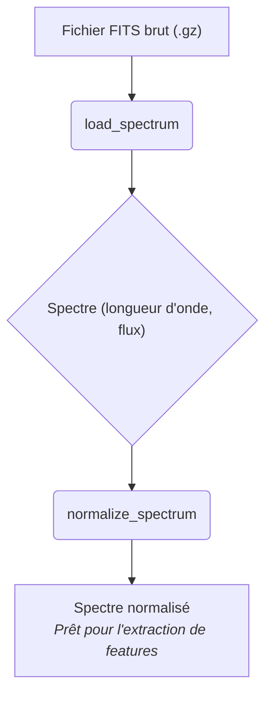

<!-- Complet for v0.1.0-alpha release -->

import { FontAwesomeIcon } from '@fortawesome/react-fontawesome'
import { faTools, faArrowRight, faFileCode, faObjectGroup, faExclamationTriangle, faLightbulb, faBook, faProjectDiagram } from '@fortawesome/free-solid-svg-icons'
import Admonition from '@theme/Admonition';

## <FontAwesomeIcon icon={faTools} /> `preprocessor.py`

> Ce module contient la classe `SpectraPreprocessor`, responsable du chargement et du nettoyage initial des spectres bruts. C'est la toute première étape de traitement actif du pipeline.

## <FontAwesomeIcon icon={faProjectDiagram} /> Workflow du Prétraitement

<div style={{textAlign: 'center', backgroundColor: 'var(--ifm-background-color-secondary)', padding: '1rem', borderRadius: 'var(--ifm-card-border-radius)'}}>



</div>

## <FontAwesomeIcon icon={faObjectGroup} /> Classe SpectraPreprocessor

> Encapsule la logique pour lire un fichier FITS de LAMOST DR5 et appliquer un prétraitement simple.

### Instanciation

La classe ne prend aucun argument à l'initialisation.

```python title="Comment l'utiliser"
from src.pipeline.preprocessor import SpectraPreprocessor

# Crée une instance du preprocessor
preprocessor = SpectraPreprocessor()
```

## Méthodes Publiques :


### ``load_spectrum(hdul)``

> Cette méthode est le cœur du chargement des données. Elle est spécifiquement conçue pour le format de données de LAMOST DR5.

<details>
<summary>Cliquez pour voir les détails de la méthode</summary>
- **Description :** Extrait le spectre (longueur d'onde, flux) à partir d'un objet ``HDUList`` (provenant de ``astropy.io.fits``).
- **Arguments :**
  - ``hdul (astropy.io.fits.HDUList)`` : L'objet FITS ouvert contenant les données du spectre.
- **Retourne :**
  - tuple ``(np.ndarray, np.ndarray)`` : Un tuple contenant deux tableaux NumPy : ``(wavelength, flux)``.
- <FontAwesomeIcon icon={faExclamationTriangle} /> Erreurs Possibles :
  - ``ValueError`` : Levée si les mots-clés ``COEFF0`` ou ``COEFF1`` sont absents de l'en-tête FITS, rendant la reconstruction de l'axe des longueurs d'onde impossible.
- <FontAwesomeIcon icon={faLightbulb} /> Contexte Scientifique :
  - Cette méthode est spécifiquement adaptée au format des données LAMOST DR5, où l'axe des longueurs d'onde est défini par une échelle log-linéaire. Elle ne fonctionnera pas "telle quelle" pour des relevés comme SDSS qui utilisent une structure de header différente.
- Logique :
  1. Extrait le vecteur de flux depuis la première extension de données ``(hdul[0].data[0])``.
  2. Reconstruit le vecteur des longueurs d'onde en Angströms en utilisant les coefficients ``COEFF0`` et ``COEFF1`` de l'en-tête FITS.
</details>

<br/>

### ``normalize_spectrum(flux)``

> Applique une normalisation simple pour ramener les spectres à une échelle comparable.

<details>
<summary>Cliquez pour voir les détails de la méthode</summary>
- **Description :** Normalise un vecteur de flux en le divisant par sa valeur médiane.
- **Arguments :**
  - ``flux (np.ndarray)`` : Le vecteur de flux du spectre.
- **Retourne :**
  - ``np.ndarray`` : Le vecteur de flux normalisé.
- <FontAwesomeIcon icon={faExclamationTriangle} /> Erreurs Possibles :
  - Aucune erreur n'est levée directement. Si la médiane du flux est nulle ou négative, la méthode retourne le flux original pour éviter une division par zéro ou des valeurs aberrantes.
- <FontAwesomeIcon icon={faLightbulb} /> Contexte Scientifique :
  - La normalisation par la médiane a été choisie pour sa robustesse aux outliers. Contrairement à la moyenne, la médiane est peu affectée par des pixels cosmiques ou des artéfacts très brillants, ce qui en fait un choix plus sûr pour un traitement automatisé en masse.
</details>

<br/>

### <FontAwesomeIcon icon={faBook} /> Exemples d'Utilisation & Bonnes Pratiques

#### Exemple de base

> Ce snippet montre le workflow nominal pour un seul fichier.

```python title="Exemple d'utilisation complète"
from astropy.io import fits
from src.pipeline.preprocessor import SpectraPreprocessor

# Chemin vers un fichier FITS d'exemple (compressé)
fits_path = "data/raw/PLAN_NAME/spectrum_file.fits.gz" 

preprocessor = SpectraPreprocessor()

# Utiliser astropy.io.fits pour ouvrir le fichier
# Note : Pour les fichiers .gz, astropy les gère automatiquement
with fits.open(fits_path) as hdul:
    
    # 1. Charger le spectre
    wavelength, flux = preprocessor.load_spectrum(hdul)
    
    # 2. Normaliser le flux
    flux_normalized = preprocessor.normalize_spectrum(flux)

print(f"Spectre chargé. Longueur d'onde de {wavelength.min():.2f} à {wavelength.max():.2f} Å.")
print(f"Flux normalisé (moyenne) : {flux_normalized.mean():.2f}")
```
<div className="container" style={{padding: '0', marginTop: '2rem'}}>
<div className="row">
<div className="col col--6">
<Admonition type="info" title="Bonnes Pratiques" icon="💡">
<ul>
<li><strong>Ordre :</strong> Le prétraitement est toujours la première étape.</li>
<li><strong>Idempotence :</strong> Ne normalisez pas un spectre déjà normalisé.</li>
<li><strong>Batch :</strong> Pour traiter de nombreux fichiers, utilisez une boucle avec <code>tqdm</code> pour le suivi.</li>
</ul>
</Admonition>
</div>
<div className="col col--6">
<Admonition type="note" title="Ressources & Code Source" icon="🔗">
<ul>
<li><a href="https://github.com/PhD-Brown/AstroSpectro/blob/main/src/pipeline/preprocessor.py" target="_blank">Code source de <code>preprocessor.py</code></a></li>
<li><a href="https://docs.astropy.org/en/stable/io/fits/" target="_blank">Documentation Astropy FITS</a></li>
<li><a href="http://dr5.lamost.org/" target="_blank">Documentation LAMOST DR5</a></li>
</ul>
</Admonition>
</div>
</div>
</div>
<div className="card">
<div className="card__header" style={{display: 'flex', alignItems: 'center', gap: '0.5rem'}}>
<FontAwesomeIcon icon={faArrowRight} />
<h3>Prochaine Étape du Pipeline</h3>
</div>
<div className="card__body">
<p>Une fois le spectre normalisé, il est prêt pour être transformé en un vecteur de features numériques.</p>
</div>
<div className="card__footer">
<a href="../user-guides/extracting-features" className="button button--primary button--block">
Aller au Guide sur l'Extraction de Features
</a>
</div>
</div>