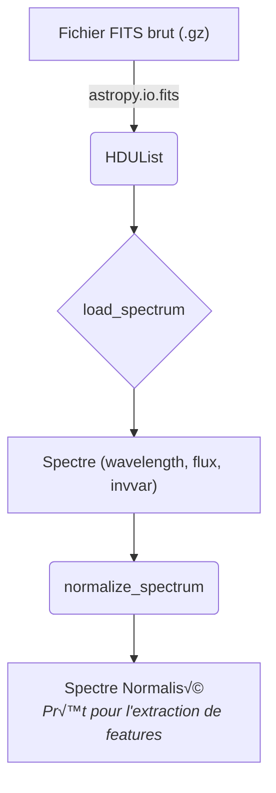

<!-- Complet for v1.0.0 release -->

import { FontAwesomeIcon } from '@fortawesome/react-fontawesome'
import { faTools, faFileCode, faObjectGroup, faExclamationTriangle, faLightbulb, faBook, faProjectDiagram, faArrowRight } from '@fortawesome/free-solid-svg-icons'
import Admonition from '@theme/Admonition';

## <FontAwesomeIcon icon={faFileCode} /> `preprocessor.py`

> Ce module contient la classe `SpectraPreprocessor`, responsable du chargement et du nettoyage initial des spectres bruts. C'est la toute première étape de traitement actif du pipeline.

## <FontAwesomeIcon icon={faProjectDiagram} /> Workflow du Prétraitement

<div style={{textAlign: 'center', backgroundColor: 'var(--ifm-background-color-secondary)', padding: '1rem', borderRadius: 'var(--ifm-card-border-radius)'}}>


```mermaid
graph TD
    A["Fichier FITS brut (.gz)"] -->|astropy.io.fits| B(HDUList);
    B --> C{load_spectrum};
    C --> D["Spectre (wavelength, flux, invvar)"];
    D --> E(normalize_spectrum);
    E --> F[Spectre Normalisé<br><i>Prêt pour l'extraction de features</i>];
```
</div>

## <FontAwesomeIcon icon={faObjectGroup} /> Classe SpectraPreprocessor

> Encapsule la logique pour lire un fichier FITS de LAMOST DR5 et appliquer un prétraitement simple.

### Instanciation

La classe ne prend aucun argument à l'initialisation.

```python title="Comment l'utiliser"
from src.pipeline.preprocessor import SpectraPreprocessor

# Crée une instance du preprocessor
preprocessor = SpectraPreprocessor()
```

## Méthodes Publiques :

### ``load_spectrum(hdul)``

> Cette méthode est le cœur du chargement des données. Elle est spécifiquement conçue pour le format de données de LAMOST DR5.

<details>
<summary>Cliquez pour voir les détails de la méthode</summary>
- **Description :** Extrait le spectre (longueur d'onde, flux) et l'inverse de la variance à partir d'un objet `HDUList` ouvert.
- **Arguments :**
- `hdul (astropy.io.fits.HDUList)` : L'objet FITS ouvert.
- **Retourne :**
- `tuple (np.ndarray, np.ndarray, np.ndarray)` : Un tuple contenant trois tableaux NumPy : `(wavelength, flux, invvar)`.
- <FontAwesomeIcon icon={faExclamationTriangle} /> **Erreurs Possibles :**
- `ValueError` : Levée si les mots-clés `COEFF0` ou `COEFF1` sont absents de l'en-tête, ou si la structure de données est invalide.
- <FontAwesomeIcon icon={faLightbulb} /> **Contexte Scientifique :**
- Cette méthode est spécifiquement adaptée au format des données LAMOST DR5. Elle extrait le flux de la première ligne de la matrice de données, l'inverse de la variance de la deuxième, et reconstruit l'axe des longueurs d'onde en Angströms en utilisant les coefficients `COEFF0` et `COEFF1` de l'en-tête FITS.
</details>

<br/>

### ``normalize_spectrum(flux)``

> Applique une normalisation simple pour ramener les spectres à une échelle comparable.

<details>
<summary>Cliquez pour voir les détails de la méthode</summary>
- **Description :** Normalise un vecteur de flux en le divisant par sa valeur médiane.
- **Arguments :**
- `flux (np.ndarray)` : Le vecteur de flux du spectre.
- **Retourne :**
- `np.ndarray` : Le vecteur de flux normalisé.
- <FontAwesomeIcon icon={faExclamationTriangle} /> **Erreurs Possibles :**
- Aucune. Si la médiane est nulle ou négative, la méthode retourne le flux original pour éviter les erreurs de calcul.
- <FontAwesomeIcon icon={faLightbulb} /> **Contexte Scientifique :**
- La normalisation par la médiane a été choisie pour sa robustesse aux *outliers* (comme les rayons cosmiques). Elle permet de ramener le continuum du spectre à une valeur proche de 1.0, ce qui est essentiel pour comparer la forme des raies spectrales entre différentes étoiles.
</details>

<br/>

### <FontAwesomeIcon icon={faBook} /> Exemples d'Utilisation & Bonnes Pratiques

#### Exemple de base

> Ce snippet montre le workflow nominal pour un seul fichier.

```python title="Exemple d'utilisation complète"
from astropy.io import fits
from src.pipeline.preprocessor import SpectraPreprocessor

# Chemin vers un fichier FITS d'exemple (compressé)
fits_path = "data/raw/PLAN_NAME/spectrum_file.fits.gz" 

preprocessor = SpectraPreprocessor()

# Utiliser astropy.io.fits pour ouvrir le fichier
# Note : Pour les fichiers .gz, astropy les gère automatiquement
with fits.open(fits_path) as hdul:
    
    # 1. Charger le spectre
    wavelength, flux = preprocessor.load_spectrum(hdul)
    
    # 2. Normaliser le flux
    flux_normalized = preprocessor.normalize_spectrum(flux)

print(f"Spectre chargé. Longueur d'onde de {wavelength.min():.2f} à {wavelength.max():.2f} Å.")
print(f"Flux normalisé (moyenne) : {flux_normalized.mean():.2f}")
```
<br/>
<div className="container" style={{padding: '0', marginTop: '2rem'}}>
<div className="row">
<div className="col col--6">
<Admonition type="info" title="Bonnes Pratiques" icon="üí°">
<ul>
<li><strong>Ordre :</strong> Le prétraitement est toujours la première étape active du pipeline.</li>
<li><strong>Robustesse :</strong> Le code est encapsulé dans des blocs <code>try...except</code> dans le pipeline principal pour gérer les fichiers FITS corrompus.</li>
<li><strong>Batch :</strong> Pour traiter de nombreux fichiers, cette classe est appelée en boucle par le <code>ProcessingPipeline</code>.</li>
</ul>
</Admonition>
</div>
<div className="col col--6">
<Admonition type="note" title="Ressources & Code Source" icon="üîó">
<ul>
<li><a href="https://github.com/PhD-Brown/AstroSpectro/blob/main/src/pipeline/preprocessor.py" target="_blank">Code source de <code>preprocessor.py</code></a></li>
<li><a href="https://docs.astropy.org/en/stable/io/fits/" target="_blank">Documentation Astropy FITS</a></li>
<li><a href="http://dr5.lamost.org/" target="_blank">Documentation LAMOST DR5</a></li>
</ul>
</Admonition>
</div>
</div>
</div>
<br/>
<div className="card">
<div className="card__header" style={{display: 'flex', alignItems: 'center', gap: '0.5rem'}}>
<FontAwesomeIcon icon={faArrowRight} />
<h3>Prochaine Étape du Pipeline</h3>
</div>
<div className="card__body">
<p>Une fois le spectre normalisé, il est prêt pour être transformé en un vecteur de features numériques.</p>
</div>
<div className="card__footer">
<a href="../user-guides/extracting-features" className="button button--primary button--block">
Aller au Guide sur l'Extraction de Features
</a>
</div>
</div>