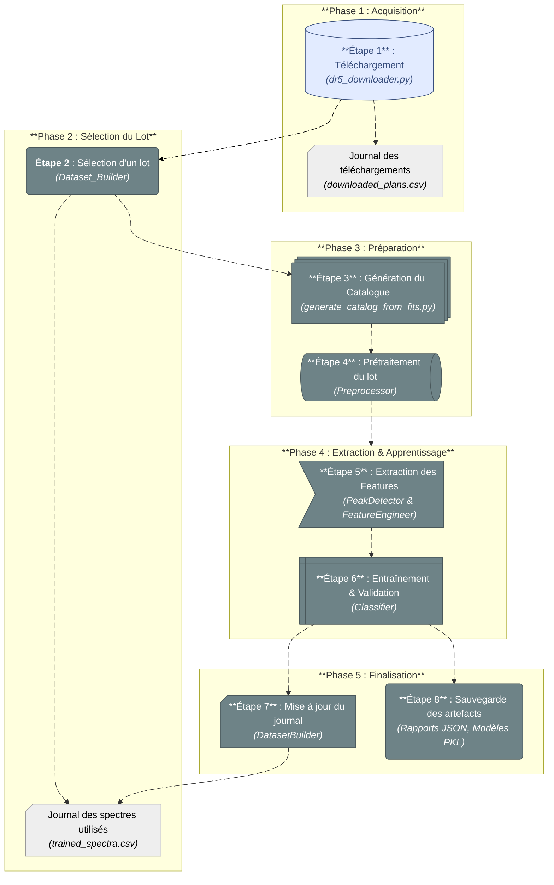

<!-- To be ompleted  -->

import { FontAwesomeIcon } from '@fortawesome/react-fontawesome'
import { faProjectDiagram } from '@fortawesome/free-solid-svg-icons'

# <FontAwesomeIcon icon={faProjectDiagram} /> Vue d'Ensemble du Pipeline

Cette page présente le flux de travail complet du projet **AstroSpectro**, de l'acquisition des données brutes à la génération des résultats de classification. Le pipeline est conçu comme une série d'étapes séquentielles et modulaires.

### Diagramme du Flux de Travail

> Le schéma ci-dessous illustre les grandes phases du pipeline. Chaque phase est mise en œuvre par un ou plusieurs modules spécifiques dans le code source.

### Description des Phases

<h4>1. Acquisition</h4>

Le point de départ. Le pipeline récupère automatiquement les spectres bruts depuis une source externe (LAMOST DR5) et les stocke localement. Il journalise les plans d'observation complétés pour éviter les téléchargements redondants.

<h4>2. Sélection & Préparation</h4>

À chaque exécution, un nouveau lot de travail est sélectionné parmi les spectres disponibles qui n'ont jamais été traités. Ses métadonnées sont extraites des en-têtes FITS et les spectres sont nettoyés (normalisation...). C'est une étape cruciale pour garantir la qualité des données.

<h4>3. Modélisation</h4>

Le cœur de l'analyse. Les spectres sont analysés pour en extraire des features physiquement pertinentes (présence de raies...). Ces features sont ensuite utilisées pour entraîner un modèle de Machine Learning supervisé.

<h4>4. Finalisation</h4>

Une fois le modèle entraîné, le pipeline conclut la session : il met à jour le journal des spectres traités, et génère un rapport de session ainsi que d'autres artefacts (modèle sauvegardé...) pour assurer la traçabilité.

