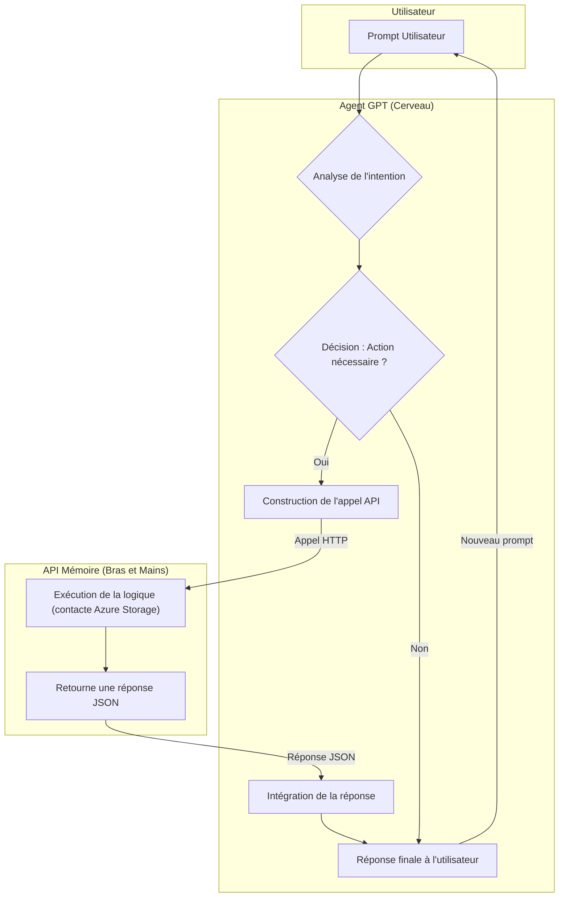

<!-- To be ompleted  -->

import { FontAwesomeIcon } from '@fortawesome/react-fontawesome'
import { faProjectDiagram } from '@fortawesome/free-solid-svg-icons'

# <FontAwesomeIcon icon={faProjectDiagram} /> Vue d'Ensemble du Pipeline

Cette page présente le flux de travail complet du projet **AstroSpectro**, de l'acquisition des données brutes à la génération des résultats de classification. Le pipeline est conçu comme une série d'étapes séquentielles et modulaires.

### Diagramme du Flux de Travail

Le schéma ci-dessous illustre les grandes phases du pipeline. Chaque phase est mise en œuvre par un ou plusieurs modules spécifiques dans le code source.

### Description des Phases

1. Ingestion :  
Le point de départ. Le pipeline récupère automatiquement les spectres bruts depuis une source externe (LAMOST DR5) et les stocke localement. La gestion d'état permet d'éviter les téléchargements redondants.

2. Préparation des Données :  
Les données brutes sont transformées pour être prêtes à l'analyse. Un lot de travail est sélectionné, ses métadonnées sont extraites des en-têtes FITS, et les spectres sont nettoyés (normalisation, etc.). C'est une étape cruciale pour garantir la qualité des données en entrée du modèle.

3. Traitement & Modélisation :  
Le cœur de l'analyse scientifique. Les spectres prétraités sont analysés pour en extraire des features physiquement pertinentes (présence/absence de raies). Ces features sont ensuite utilisées pour entraîner un modèle de Machine Learning supervisé.

4. Finalisation :  
Une fois le modèle entraîné et évalué sur le lot de travail, le pipeline finalise la session. Il met à jour le journal des spectres traités pour ne pas les réutiliser, et génère un rapport de session complet (métriques, paramètres) pour assurer la traçabilité et la reproductibilité des expériences.