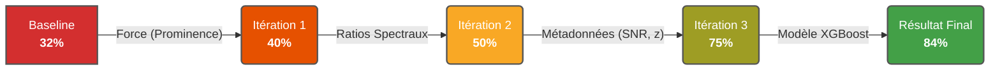

<!-- Complet for v1.0.0 release -->

import { FontAwesomeIcon } from '@fortawesome/react-fontawesome'
import { faChartBar, faSearch, faFlask, faPersonDigging, faMagnifyingGlassChart } from '@fortawesome/free-solid-svg-icons'

# <FontAwesomeIcon icon={faMagnifyingGlassChart} /> Analyse des Résultats

# Analyse des Résultats

Cette section présente les résultats obtenus par le pipeline de classification **AstroSpectro**. L'approche adoptée est **itérative** : nous sommes partis d'une baseline simple pour progressivement enrichir les *features* et optimiser les modèles, en mesurant l'impact de chaque changement.

Les résultats présentés ici sont basés sur des entraînements et des évaluations rigoureuses, utilisant une **validation croisée stratifiée** et un **tuning des hyperparamètres** pour garantir leur fiabilité.

## Le Voyage : De 32% à 84% de Précision

Notre démarche a suivi un parcours d'optimisation en plusieurs actes, démontrant l'importance cruciale du *feature engineering* guidé par la physique et l'analyse de données.



- **De 32% à 50% :** L'introduction de features physiques de base (force et ratios des raies) a permis de construire une fondation solide, améliorant le score de **+18 points**.
- **La Percée à 75% :** Le bond le plus spectaculaire (**+25 points !**) est venu de l'ajout des métadonnées contextuelles (``redshift, SNR``). C'est la preuve que le modèle performe mieux quand il connaît non seulement le signal (le spectre) mais aussi le contexte de la mesure.
- **L'Optimisation Finale à 84% :** Le passage à un algorithme plus puissant, ``XGBoost``, a permis de gratter **+9 points** supplémentaires en exploitant plus finement les relations complexes entre toutes nos features.

## Benchmark des Modèles : RandomForest vs. XGBoost

Nous avons testé deux algorithmes de classification principaux sur notre jeu de *features* final, qui combine des mesures physiques des raies spectrales (force, largeur), des ratios et des métadonnées contextuelles.

### 1. RandomForest Optimisé

Le `RandomForestClassifier` a servi de cheval de bataille tout au long de notre développement. Après un tuning rigoureux via `GridSearchCV`, il a atteint une performance très respectable.

<details>
  <summary>Cliquez pour voir les résultats détaillés du RandomForest</summary>
  <br/>
  
  *   **Précision (Validation Croisée) :** 79.5%
  *   **Précision (Test Final) :** 81%

  **Rapport de Classification :**
  ```
  precision    recall  f1-score   support
       A       0.79      0.90      0.84        29
       F       0.76      0.67      0.71        97
       G       0.79      0.77      0.78       154
       K       0.75      0.86      0.80       104
       M       0.88      0.80      0.84        46
       N       0.99      0.99      0.99        67

  accuracy                         0.81       497
 macro avg     0.82     0.83      0.82       497
 weighted avg  0.81     0.81      0.81       497
```
 **Matrice de Confusion :**


</details>

### 2. XGBoost : Le Challenger Haute Performance

Pour pousser les performances à leur maximum, nous avons testé un modèle de Gradient Boosting, `XGBoost`, réputé pour son efficacité sur les données tabulaires.

<details>
  <summary>Cliquez pour voir les résultats détaillés du XGBoost (Meilleur Modèle)</summary>
  <br/>

*   **Précision (Validation Croisée) :** 82.3%
*   **Précision (Test Final) :** 84%

**Rapport de Classification :**
```
precision    recall  f1-score   support
       A       0.85      0.79      0.82        29
       F       0.79      0.79      0.79        98
       G       0.82      0.80      0.81       143
       K       0.77      0.85      0.81       101
       M       0.94      0.82      0.88        57
       N       0.97      1.00      0.99        69

  accuracy                         0.84       497
 macro avg     0.86      0.84      0.85       497
weighted avg   0.84      0.84      0.84       497
```

**Matrice de Confusion :**

</details>

**Conclusion du benchmark :** Avec une précision de **84%** contre **81%** pour le ``RandomForest`` sur le même jeu de données, **XGBoost s'est avéré être le modèle le plus performant**. Il démontre une meilleure capacité à séparer les classes spectrales complexes, en particulier dans la région ``G/K/M``.

## L'Anatomie de la Décision : Importance des Features

Comprendre *pourquoi* un modèle fonctionne est aussi important que de mesurer sa performance. Le graphique ci-dessous montre les *features* que notre meilleur modèle (``XGBoost``) a jugées les plus importantes pour prendre ses décisions.


### Observations Clés :

-   **Le Contexte est Roi :** Les métadonnées comme l'**erreur sur le redshift** et l'**indice de couleur** (qui est un proxy de la température) sont les indicateurs les plus puissants. Cela démontre que le contexte de l'observation est crucial.
-   **La Physique Valide l'IA :** Les *features* que nous avons construites, comme la **largeur (FWHM)** et la **force (prominence)** des raies, figurent en bonne place. Le modèle a bien appris à utiliser ces indicateurs physiques.
-   **Synergie :** La meilleure performance est atteinte en combinant le contexte de l'observation avec les propriétés physiques du spectre.

## Prochaines Étapes

Ces résultats valident notre approche et notre architecture. Le pipeline AstroSpectro est maintenant une plateforme solide pour de futures recherches. Les prochaines étapes, détaillées dans notre [**Roadmap**](/docs/community/roadmap), se concentreront sur :

-   L'ajout de *features* spécifiques aux étoiles les plus froides (bandes moléculaires de ``TiO``).
-   L'exploration de l'IA explicable (``XAI``) avec des outils comme SHAP pour comprendre les prédictions individuelles.
-   Le passage à des architectures de Deep Learning (``CNN 1D``) pour exploiter l'intégralité du signal spectral.

## Limites et Points à Surmonter

Malgré l'amélioration spectaculaire des scores, cette étude présente certaines limites qui constituent des axes de recherche futurs passionnants :

*   **Biais du Dataset :** La distribution des classes reste déséquilibrée. Bien que des techniques comme ``SMOTE`` aient été utilisées, la performance sur les classes stellaires intrinsèquement rares reste un défi.
*   **Qualité des Données :** Certains spectres présentent des artefacts instrumentaux ou des zones de faible signal/bruit qui n'ont pas été corrigées de manière systématique. Un prétraitement plus avancé (comme la correction du continuum) pourrait encore améliorer la robustesse.
*   **Feature Engineering Manuel :** Beaucoup de nos *features* restent "faites main". Une exploration systématique via des techniques de *feature selection* automatisée ou d'AutoML pourrait révéler des combinaisons d'indicateurs encore plus performantes.

Nous poursuivons nos efforts pour lever ces verrous dans les prochaines versions du pipeline.